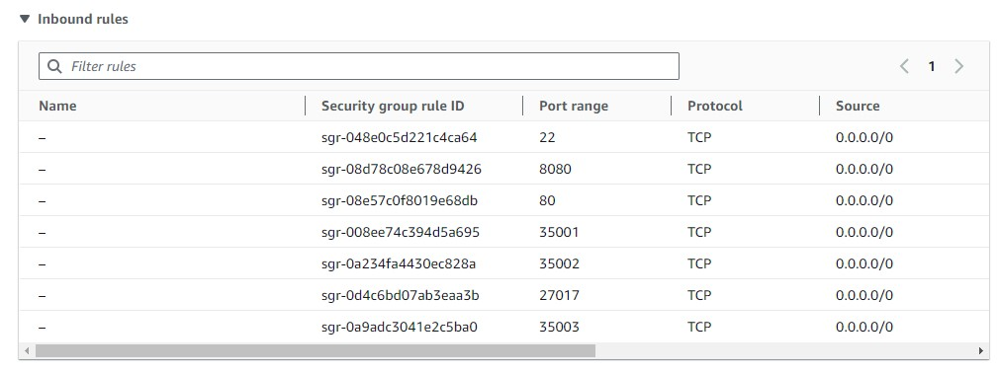
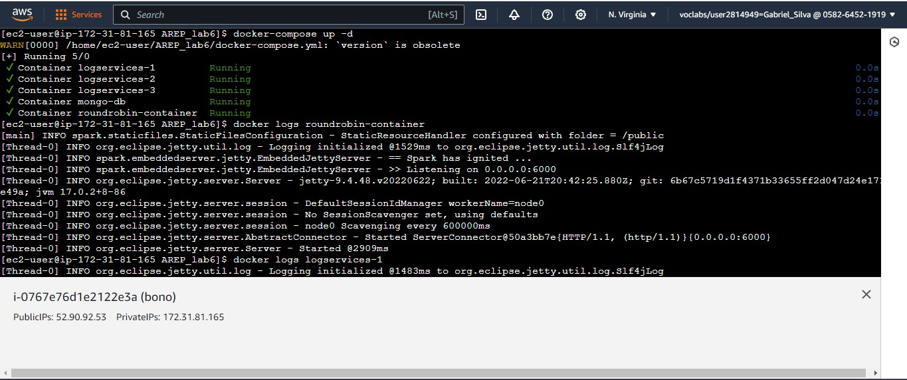
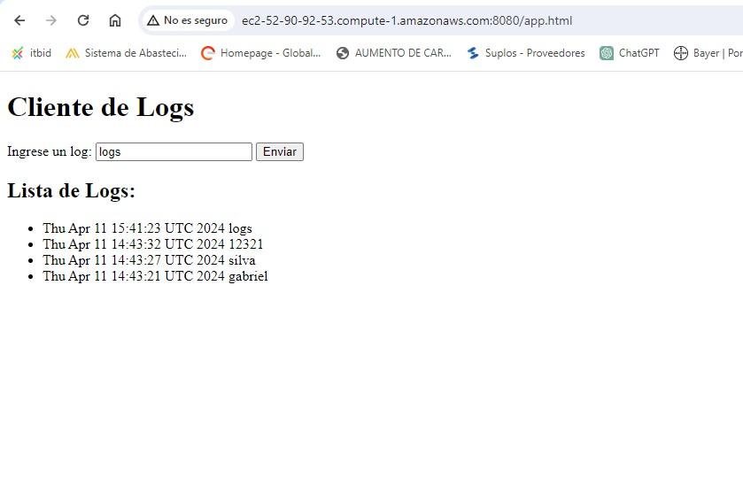
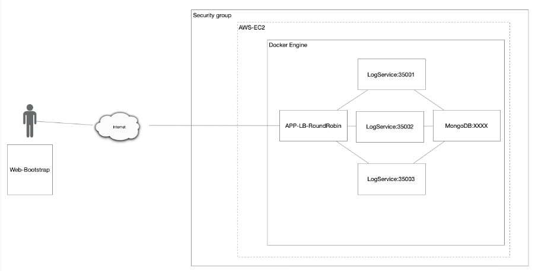

# Bono: Arep - Patrones Arquitecturales

En este laboratorio, vamos a construir una aplicación distribuida utilizando Docker y Docker Compose. Tenemos dos partes clave: un servicio que registra logs y otro que enruta solicitudes. El servicio de logs guarda mensajes en una base de datos MongoDB, mientras que el enrutador distribuye solicitudes entre múltiples instancias de este servicio. Usaremos Docker para encapsular cada parte de la aplicación y Docker Compose para ejecutarla fácilmente en cualquier entorno.

## Tecnologías Utilizadas

- **Maven**: Herramienta de gestión de proyectos que facilita la compilación y administración de dependencias.
- **Git y GitHub**: Utilizados para el control de versiones y la colaboración en el desarrollo del proyecto.
- **SparkJava**: Framework ligero de Java para la creación de aplicaciones web.
- **HTML5**: Utilizado para la estructura y el contenido de las páginas web.
- **JavaScript**: Utilizado para la interactividad y la lógica de la aplicación en el lado del cliente.

## Instalación

Para compilar y ejecutar este proyecto, siga los siguientes pasos:

### 1. Configuración de las Instancias de AWS

1. Acceda a la página oficial de Amazon AWS y cree tres instancias EC2.
2. Configure las reglas de seguridad para permitir el tráfico en los puertos necesarios para ejecutar la aplicación.

### 2. Instalación de Herramientas

Instale las siguientes herramientas en la instancia EC2:

- **Git**: `sudo yum install git -y`
- **Java**: `sudo yum install java-17-amazon-corretto.x86_64`
- **Maven**: `sudo yum install maven -y`
- **Docker-Compose**: `sudo curl -L "https://github.com/docker/compose/releases/latest/download/docker-compose-$(uname -s)-$(uname -m)" -o /usr/local/bin/docker-compose`

### 3. Compilación del Proyecto

Clone el repositorio del proyecto y compile el código:

- `git clone https://github.com/GabrielSilva2111/ArepLab-6.git`
- `cd ArepLab-6`
- `mvn clean package install`

Una vez compilado,lo que haremos es compilar el siguiente repositorio:
- `git clone https://github.com/GabrielSilva2111/RoundRobin.git`
- `cd RoundRobin`
- `mvn clean package install`

### 4. Ejecución de la Aplicación
En la instancia EC2, ejecutaremos los siguientes comandos
para iniciar la apliación

- `docker build --tag roundrobin-java .`
- `cd ArepLab-6`
- `docker build --tag logservices .`

Una vez creadas nuestras imagenes , descargamos la imagen de mongo
- `docker pull mongo`

Por último inciamos los servicios guardados en nuestro composer
- `docker-compose up -d `

### Pruebas y despliegue AWS

las siguientes pruebas Son para probar los servicios LogService

### Arquitectura
La aplicación consta de tres componentes principales:

Servicio MongoDB: Corre en un contenedor Docker en una máquina virtual de EC2. Almacena mensajes en una base de datos MongoDB.

LogService: Es un servicio REST que recibe cadenas de texto, las almacena en la base de datos MongoDB y devuelve las últimas 10 cadenas almacenadas junto con sus fechas en formato JSON.

Aplicación Web (APP-LB-RoundRobin): Incluye un cliente web con un campo de texto y un botón. Cuando el usuario envía un mensaje, este se envía al servicio REST. El servicio utiliza un algoritmo de balanceo de carga Round Robin para procesar el mensaje y devolver una respuesta. Hay al menos tres instancias del servicio LogService involucradas en el procesamiento de los mensajes.

### Video Demostración:
[video bono](https://www.youtube.com/watch?v=gFMJ2cKCY6A)